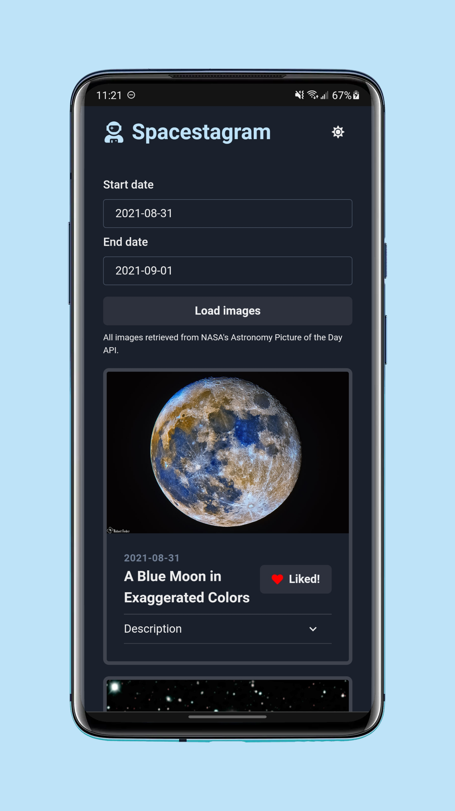

# NextAvailableRead
A web application to explore [NASA's Astronomy Picture of the Day](https://api.nasa.gov/#apod) library.

Users can find photos by date, and like and unlike photos. The likes persist between page refreshes, using localStorage.

App built with TypeScript, React, and Chakra UI.

Deployed using Netlify to [spacestagram.orenscheer.me](https://spacestagram.orenscheer.me).

